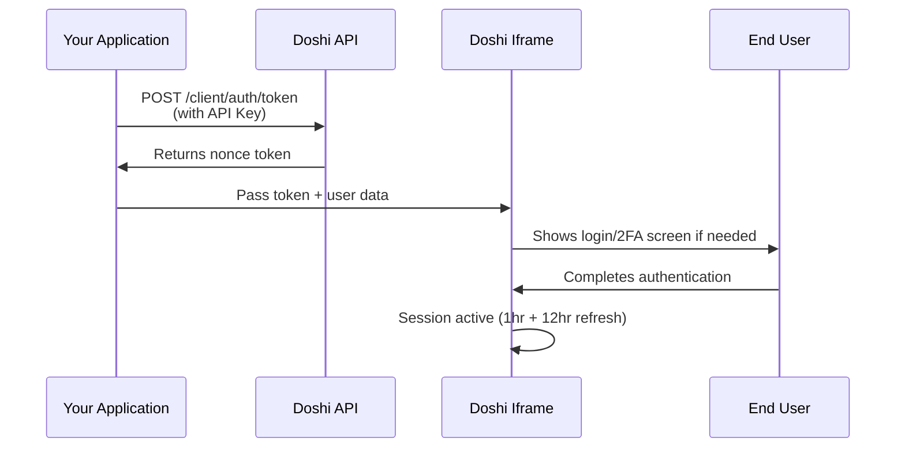

## Overview

Doshi webview authentication uses a secure two-step process:

1. **Generate a nonce token** by calling the Doshi API with your API key
2. **Pass the token to the iframe** using postMessage or query parameters

<Steps>
  <Step title="Get API Key">
    Contact [hello@doshi.app](mailto:hello@doshi.app) to receive your static API key
  </Step>
  <Step title="Generate Nonce Token">
    Call the authentication endpoint with your API key to generate a nonce token
  </Step>
  <Step title="Embed Webview">
    Pass the nonce token to the Doshi iframe using postMessage or query parameters
  </Step>
  <Step title="User Signs In">
    Doshi handles the sign-in process, including 2FA if enabled
  </Step>
</Steps>

## Authentication Flow


## Step 1: Generate Nonce Token

Call the authentication endpoint with your API key:
```bash
curl -X POST https://production-doshi-api-8kq2.encr.app/client/auth/token \
  -H "Authorization: Bearer YOUR_API_KEY" \
  -H "Content-Type: application/json" \
  -d '{
    "email": "user@example.com",
    "partnerUserId": "partner_123",
    "firstName": "John",
    "lastName": "Doe",
    "pathId": "path_456",
    "branchId": "branch_789"
  }'
```

<Note>
  You must provide either `email` OR `partnerUserId` (or both). Other fields are optional.
</Note>

**Response:**
```json
{
  "token": "eyJhbGciOiJIUzI1NiIsInR5cCI6IkpXVCJ9...",
  "userId": "user_123",
  "isNewUser": false,
  "institutionId": "inst_456",
  "branchId": "branch_789"
}
```

See the [full API reference](/api-reference/auth/get-custom-authentication-token) for details.

## Step 2: Pass Token to Iframe

Pass the nonce token to the Doshi iframe using one of two methods:

<CardGroup cols={2}>
  <Card title="postMessage (Recommended)" icon="message" href="/webview/postmessage">
    Secure, real-time communication for sensitive data
  </Card>
  <Card title="Query Parameters" icon="link" href="/webview/query-parameters">
    Simple URL-based authentication
  </Card>
</CardGroup>

### Required Parameter

<ParamField path="token" type="string" required>
  The nonce token received from the API
</ParamField>

### Optional Parameters

<ParamField path="email" type="string">
  User's email address
</ParamField>

<ParamField path="segment" type="string">
  Used for handling multiple learning paths under the same organization
</ParamField>

<ParamField path="branchId" type="string">
  Branch or location identifier
</ParamField>

### 2FA Parameters (Optional)

When 2FA is enabled for your organization, pass these additional parameters so the iframe can handle the OTP flow:

<ParamField path="is2FaEnabled" type="boolean">
  Set to `true` to enable 2FA flow in the iframe
</ParamField>

<ParamField path="dob" type="string">
  User's date of birth (required for 2FA, format: YYYY-MM-DD)
</ParamField>

<ParamField path="organizationId" type="string">
  Your organization ID (required for 2FA)
</ParamField>

<ParamField path="partnerUserId" type="string">
  Your internal user ID (required for 2FA)
</ParamField>

<ParamField path="firstName" type="string">
  User's first name (required for 2FA)
</ParamField>

<ParamField path="lastName" type="string">
  User's last name (required for 2FA)
</ParamField>

<Note>
  When 2FA is enabled, the Doshi iframe automatically handles the OTP send and verification flow. You don't need to call the OTP endpoints separately.
</Note>

## Step 3: Session Management

Once authenticated, the Doshi iframe automatically manages the session:

- **ID Token TTL**: 1 hour
- **Refresh Token TTL**: 12 hours
- **Auto-refresh**: The iframe automatically refreshes tokens as needed

No additional action required from your application!

## Quick Example

### React with postMessage
```tsx
import React, { useEffect, useState } from "react";

const DoshiEmbed = () => {
  const [token, setToken] = useState<string | null>(null);

  useEffect(() => {
    // Step 1: Get nonce token from API
    async function authenticate() {
      const response = await fetch('https://production-doshi-api-8kq2.encr.app/client/auth/token', {
        method: 'POST',
        headers: {
          'Authorization': 'Bearer YOUR_API_KEY',
          'Content-Type': 'application/json'
        },
        body: JSON.stringify({
          email: 'user@example.com',
          partnerUserId: 'partner_123',
          branchId: 'branch_789'
        })
      });
      
      const data = await response.json();
      setToken(data.token);
    }

    authenticate();
  }, []);

  useEffect(() => {
    if (!token) return;

    // Step 2: Listen for PING from iframe
    const handleMessage = (event: MessageEvent) => {
      if (event.origin !== 'https://embed.doshi.app') return;
      
      const data = typeof event.data === "string" 
        ? JSON.parse(event.data) 
        : event.data;

      if (data.type === "PING") {
        // Step 3: Send token to iframe
        const iframe = document.querySelector("iframe");
        if (iframe?.contentWindow) {
          iframe.contentWindow.postMessage(
            JSON.stringify({
              token,
              email: 'user@example.com',
              segment: 'premium',
              branchId: 'branch_789',
              type: "AUTH"
            }),
            "https://embed.doshi.app"
          );
        }
      }
    };

    window.addEventListener("message", handleMessage);
    return () => window.removeEventListener("message", handleMessage);
  }, [token]);

  if (!token) {
    return <div>Loading...</div>;
  }

  return (
    <iframe
      src="https://embed.doshi.app"
      className="w-full h-screen"
      frameBorder="0"
      allowFullScreen
    />
  );
};

export default DoshiEmbed;
```

### React with Query Parameters
```tsx
import React, { useEffect, useState } from "react";

const DoshiEmbed = () => {
  const [iframeUrl, setIframeUrl] = useState<string | null>(null);

  useEffect(() => {
    async function authenticate() {
      // Step 1: Get nonce token
      const response = await fetch('https://production-doshi-api-8kq2.encr.app/client/auth/token', {
        method: 'POST',
        headers: {
          'Authorization': 'Bearer YOUR_API_KEY',
          'Content-Type': 'application/json'
        },
        body: JSON.stringify({
          email: 'user@example.com',
          partnerUserId: 'partner_123'
        })
      });
      
      const data = await response.json();
      
      // Step 2: Build URL with token
      const params = new URLSearchParams({
        token: data.token,
        email: 'user@example.com',
        segment: 'premium',
        branchId: 'branch_789'
      });
      
      setIframeUrl(`https://embed.doshi.app?${params.toString()}`);
    }

    authenticate();
  }, []);

  if (!iframeUrl) {
    return <div>Loading...</div>;
  }

  return (
    <iframe
      src={iframeUrl}
      className="w-full h-screen"
      frameBorder="0"
      allowFullScreen
    />
  );
};

export default DoshiEmbed;
```

### Vanilla JavaScript
```javascript
// Step 1: Get nonce token
async function authenticateUser() {
  const response = await fetch('https://production-doshi-api-8kq2.encr.app/client/auth/token', {
    method: 'POST',
    headers: {
      'Authorization': 'Bearer YOUR_API_KEY',
      'Content-Type': 'application/json'
    },
    body: JSON.stringify({
      email: 'user@example.com',
      partnerUserId: 'partner_123'
    })
  });
  
  const data = await response.json();
  return data.token;
}

// Step 2: Create iframe with query parameters
async function createDoshiEmbed() {
  const token = await authenticateUser();
  
  const params = new URLSearchParams({
    token: token,
    email: 'user@example.com',
    segment: 'premium',
    branchId: 'branch_789'
  });
  
  const iframe = document.createElement('iframe');
  iframe.src = `https://embed.doshi.app?${params.toString()}`;
  iframe.className = 'w-full h-screen';
  iframe.frameBorder = '0';
  iframe.allowFullscreen = true;
  
  document.getElementById('doshi-container').appendChild(iframe);
}

// Initialize
createDoshiEmbed();
```

## With 2FA Enabled

When 2FA is enabled, include the additional parameters:
```tsx
const authData = {
  token: data.token,
  email: 'user@example.com',
  segment: 'premium',
  branchId: 'branch_789',
  // 2FA parameters
  is2FaEnabled: true,
  dob: '1990-01-15',
  organizationId: 'org_123',
  partnerUserId: 'partner_123',
  firstName: 'John',
  lastName: 'Doe'
};

// The iframe will automatically show OTP screen and handle verification
```

## Next Steps

<CardGroup cols={3}>
  <Card title="postMessage Method" icon="message" href="/webview/postmessage">
    Detailed postMessage implementation
  </Card>
  <Card title="Query Parameters" icon="link" href="/webview/query-parameters">
    URL-based authentication guide
  </Card>
  <Card title="Security" icon="shield" href="/webview/security">
    Security best practices
  </Card>
</CardGroup>

## Need Help?

<Card title="Contact Support" icon="envelope" href="mailto:hello@doshi.app">
  Get your API key or ask questions: hello@doshi.app
</Card>