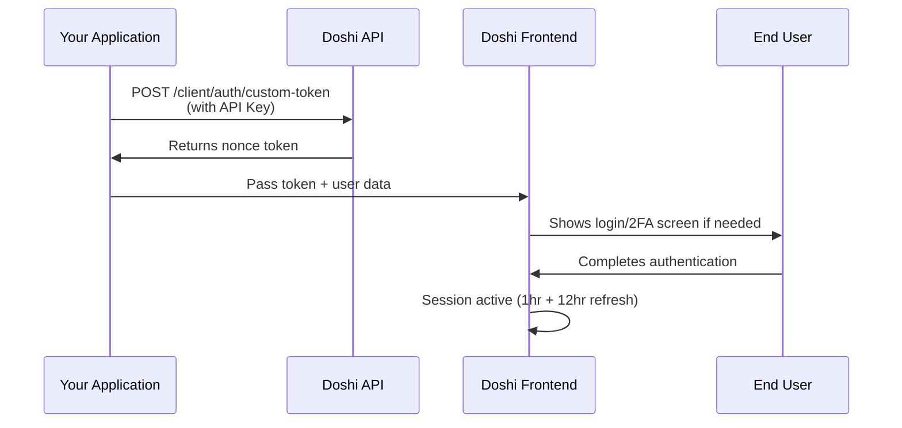

## Overview

Doshi webview authentication uses a secure two-step process:

1. **Generate a nonce token** by calling the Doshi API with your API key
2. **Pass the token to the iframe** using postMessage or query parameters

<Warning>
  **IP Whitelisting Required**: Your server's IP address must be whitelisted to access the Doshi API. Contact [hello@doshi.app](mailto:hello@doshi.app) with your server IP addresses to get started.
</Warning>

<Steps>
  <Step title="Get API Key & Whitelist IP">
    Contact [hello@doshi.app](mailto:hello@doshi.app) to:

    - Receive your API key
    - Whitelist your server IP address(es)
  </Step>
  <Step title="Generate Nonce Token">
    Call the authentication endpoint with your API key from your whitelisted server
  </Step>
  <Step title="Embed Webview">
    Pass the nonce token to the Doshi Frontend using postMessage or query parameters
  </Step>
  <Step title="User Signs In">
    Doshi handles the sign-in process, including 2FA if enabled
  </Step>
</Steps>

## Authentication Flow



## Step 1: Generate Nonce Token

Call the authentication endpoint with your API key:

```bash
curl -X POST https://production-doshi-api-8kq2.encr.app/client/auth/custom-token \
  -H "Authorization: Bearer YOUR_API_KEY" \
  -H "Content-Type: application/json" \
  -d '{
    "email": "user@example.com",
    "partnerUserId": "partner_123",
    "firstName": "John",
    "lastName": "Doe",
    "branchId": "branch_789"
  }'
```

### API Parameters

**Required (at least one):**

- `email` - User's email address
- `partnerUserId` - Your internal user ID

**Optional:**

- `firstName` - User's first name
- `lastName` - User's last name
- `branchId` - Branch or location identifier

<Note>
  You must provide either `email` OR `partnerUserId` (or both). All other fields are optional.
</Note>

**Response:**

```json
{
  "token": "eyJhbGciOiJIUzI1NiIsInR5cCI6IkpXVCJ9..."
}
```

See the [full API reference](/api-reference/auth/get-custom-authentication-token) for details.

## Step 2: Pass Token to Doshi Frontend

Pass the nonce token to the Doshi Frontend using one of two methods:

<CardGroup cols={2}>
  <Card title="postMessage (Recommended)" icon="message" href="/webview/postmessage">
    Secure, real-time communication for sensitive data
  </Card>
  <Card title="Query Parameters" icon="link" href="/webview/query-parameters">
    Simple URL-based authentication
  </Card>
</CardGroup>

### Frontend Parameters

**Required:**

- `token` - The nonce token from the API

**Optional:**

- `email` - User's email address
- `segment` - For handling multiple learning paths
- `branchId` - Branch or location identifier

### 2FA Parameters (Optional)

When 2FA is enabled, pass these additional parameters:

**`All 2FA fields are required when is2FaEnabled is true:`**

- `is2FaEnabled` - Set to `true`
- `dob` - Date of birth (YYYY-MM-DD)
- `organizationId` - Your organization ID
- `partnerUserId` - Your internal user ID
- `firstName` - User's first name
- `lastName` - User's last name

<ParamField path="token" type="string" required>
  The nonce token received from the API
</ParamField>

<ParamField path="email" type="string">
  User's email address (optional)
</ParamField>

<ParamField path="segment" type="string">
  Used for handling multiple learning paths under the same organization (optional)
</ParamField>

<ParamField path="branchId" type="string">
  Branch or location identifier (optional)
</ParamField>

<ParamField path="is2FaEnabled" type="boolean">
  Set to `true` to enable 2FA flow (optional, but if true, all 2FA fields below are required)
</ParamField>

<ParamField path="dob" type="string">
  User's date of birth - YYYY-MM-DD format (required when is2FaEnabled is true)
</ParamField>

<ParamField path="organizationId" type="string">
  Your organization ID (required when is2FaEnabled is true)
</ParamField>

<ParamField path="partnerUserId" type="string">
  Your internal user ID (required when is2FaEnabled is true)
</ParamField>

<ParamField path="firstName" type="string">
  User's first name (required when is2FaEnabled is true)
</ParamField>

<ParamField path="lastName" type="string">
  User's last name (required when is2FaEnabled is true)
</ParamField>

<Note>
  When 2FA is enabled, the Doshi Frontend automatically handles the OTP send and verification flow. You don't need to call the OTP endpoints separately.
</Note>

## Step 3: Session Management

Once authenticated, the Doshi Frontend automatically manages the session:

- **ID Token TTL**: 1 hour
- **Refresh Token TTL**: 12 hours
- **Auto-refresh**: Tokens are refreshed automatically

No additional action required from your application!

## Quick Example

### React with postMessage

```tsx
import React, { useEffect, useState } from "react";

const DoshiEmbed = () => {
  const [token, setToken] = useState<string | null>(null);

  useEffect(() => {
    // Step 1: Get nonce token from API
    async function authenticate() {
      const response = await fetch('https://production-doshi-api-8kq2.encr.app/client/auth/custom-token', {
        method: 'POST',
        headers: {
          'Authorization': 'Bearer YOUR_API_KEY',
          'Content-Type': 'application/json'
        },
        body: JSON.stringify({
          email: 'user@example.com',  // Required (or partnerUserId)
          partnerUserId: 'partner_123', // Optional (but one of email/partnerUserId required)
          branchId: 'branch_789'        // Optional
        })
      });
      
      const data = await response.json();
      setToken(data.token);
    }

    authenticate();
  }, []);

  useEffect(() => {
    if (!token) return;

    // Step 2: Listen for PING from Doshi Frontend
    const handleMessage = (event: MessageEvent) => {
      if (event.origin !== 'https://embed.doshi.app') return;
      
      const data = typeof event.data === "string" 
        ? JSON.parse(event.data) 
        : event.data;

      if (data.type === "PING") {
        // Step 3: Send token to Doshi Frontend
        const iframe = document.querySelector("iframe");
        if (iframe?.contentWindow) {
          iframe.contentWindow.postMessage(
            JSON.stringify({
              token,               // Required
              email: 'user@example.com',  // Optional
              segment: 'premium',         // Optional
              branchId: 'branch_789',     // Optional
              type: "AUTH"
            }),
            "https://embed.doshi.app"
          );
        }
      }
    };

    window.addEventListener("message", handleMessage);
    return () => window.removeEventListener("message", handleMessage);
  }, [token]);

  if (!token) {
    return <div>Loading...</div>;
  }

  return (
    <iframe
      src="https://embed.doshi.app"
      className="w-full h-screen"
      frameBorder="0"
      allowFullScreen
    />
  );
};

export default DoshiEmbed;
```

### React with Query Parameters

```tsx
import React, { useEffect, useState } from "react";

const DoshiEmbed = () => {
  const [iframeUrl, setIframeUrl] = useState<string | null>(null);

  useEffect(() => {
    async function authenticate() {
      // Step 1: Get nonce token
      const response = await fetch('https://production-doshi-api-8kq2.encr.app/client/auth/custom-token', {
        method: 'POST',
        headers: {
          'Authorization': 'Bearer YOUR_API_KEY',
          'Content-Type': 'application/json'
        },
        body: JSON.stringify({
          email: 'user@example.com',      // Required (or partnerUserId)
          partnerUserId: 'partner_123'    // Optional
        })
      });
      
      const data = await response.json();
      
      // Step 2: Build URL with token
      const params = new URLSearchParams({
        token: data.token,              // Required
        email: 'user@example.com',      // Optional
        segment: 'premium',             // Optional
        branchId: 'branch_789'          // Optional
      });
      
      setIframeUrl(`https://embed.doshi.app?${params.toString()}`);
    }

    authenticate();
  }, []);

  if (!iframeUrl) {
    return <div>Loading...</div>;
  }

  return (
    <iframe
      src={iframeUrl}
      className="w-full h-screen"
      frameBorder="0"
      allowFullScreen
    />
  );
};

export default DoshiEmbed;
```

## With 2FA Enabled

```tsx
const authData = {
  token: data.token,                    // Required
  email: 'user@example.com',            // Optional
  segment: 'premium',                   // Optional
  branchId: 'branch_789',               // Optional
  // All fields below are required when is2FaEnabled is true
  is2FaEnabled: true,
  dob: '1990-01-15',
  organizationId: 'org_123',
  partnerUserId: 'partner_123',
  firstName: 'John',
  lastName: 'Doe'
};

// The Doshi Frontend will automatically show OTP screen and handle verification
```

## Next Steps

<CardGroup cols={3}>
  <Card title="postMessage Method" icon="message" href="/webview/postmessage">
    Detailed postMessage implementation
  </Card>
  <Card title="Query Parameters" icon="link" href="/webview/query-parameters">
    URL-based authentication guide
  </Card>
  <Card title="Security" icon="shield" href="/webview/security">
    Security best practices
  </Card>
</CardGroup>

## Need Help?

<Card title="Contact Support" icon="envelope" href="mailto:hello@doshi.app">
  Get your API key or ask questions: [hello@doshi.app](mailto:hello@doshi.app)
</Card>